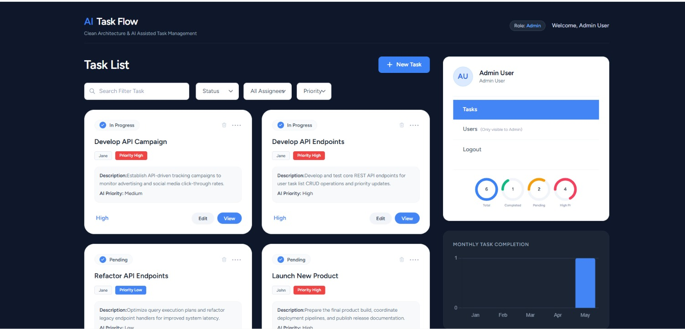
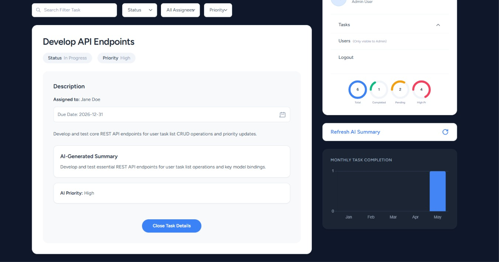
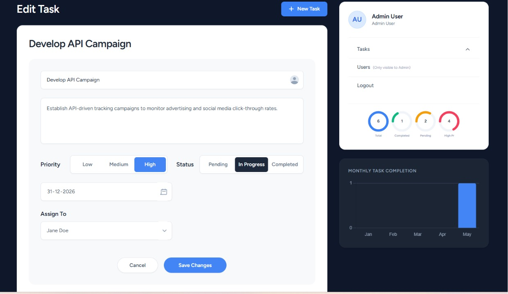
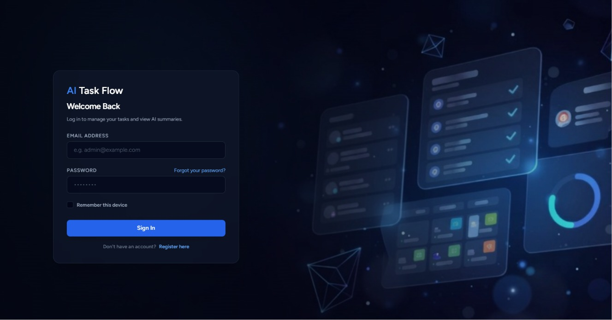

# AI-Assisted Task Management System

A production-ready Task Management System built with a Clean Architecture, using the Repository Pattern, Service Layer, and AI Integration with Gemini API (with robust mock fallback).

---

## 📸 Screenshots

### 📊 Dashboard & Tasks List


### 📄 Task Details & AI Insights


### ✏️ Task Creation & Editing


### 🔐 Login Page


---

## 🛠️ Architecture & Design Patterns

The project strictly follows the clean architecture guidelines, isolating database actions from the controller by delegating to repository interfaces and business logic service layers. It also implements the **Decorator Pattern** via `CachingTaskRepository` to seamlessly add a caching layer on top of the database without modifying the core repository logic.

```
app/
├── Http/
│   ├── Controllers/
│   │   └── TaskController.php             # No direct Eloquent calls
│   ├── Requests/
│   │   ├── TaskStoreRequest.php           # Form validation
│   │   └── TaskUpdateRequest.php          # Form validation
│   └── Resources/
│       ├── TaskResource.php               # REST API Resource
│       └── UserResource.php               # REST API Resource
├── Models/
│   └── Task.php                           # Task Model with scope filters
├── Repositories/
│   ├── Contracts/
│   │   ├── TaskRepositoryInterface.php    # Task Repository Interface
│   │   └── UserRepositoryInterface.php    # User Repository Interface
│   ├── Eloquent/
│   │   ├── TaskRepository.php             # Eloquent Implementation
│   │   └── UserRepository.php             # Eloquent Implementation
│   └── Cache/
│       └── CachingTaskRepository.php      # Decorator Pattern for Caching
├── Services/
│   ├── TaskService.php                    # Handles transactions & business logic
│   └── AIService.php                      # Gemini API Caller & Mock Fallback
├── Policies/
│   └── TaskPolicy.php                     # Auth Gate & Role Check (Admin/User)
├── Enums/
│   ├── TaskPriority.php                   # Enum for Task Priority
│   └── TaskStatus.php                     # Enum for Task Status
└── Providers/
    └── RepositoryServiceProvider.php      # Binds Contracts to Implementations
```

---

## 🔒 Authentication & Roles

The system uses **Laravel Breeze (Vue 3 + Inertia)** for session authentication.
- **Admin**: Has full access to CRUD all tasks and assign tasks to users.
- **User**: Can view and edit status only for tasks explicitly assigned to them.
- Access restrictions are strictly enforced using **Laravel Policies** and **Gate checks** on all controller operations.

---

## 🧠 AI Integration

Task analysis and recommended priority estimation is implemented in the `AIService` utilizing the **gemini-2.5-flash** model. The service dynamically analyzes task contents and predicts the priority level. The prompt template is fully documented below:

### 🤖 Gemini API Prompt Template
```
Analyze the following task details:
Title: {task_title}
Description: {task_description}
User Priority: {task_priority}
Status: {task_status}

Please provide a JSON object containing exactly two keys:
1. 'ai_summary': A concise summary of the task (1-2 sentences) explaining its main goal.
2. 'ai_priority': An independent priority recommendation ('low', 'medium', or 'high') based on the complexity and urgency described.

Return ONLY the raw JSON block, no markdown formatting, no backticks, no comments.
```

- **Mock Fallback**: If `GEMINI_API_KEY` is not present in `.env`, the service falls back to a deterministic, rule-based text analyzer that generates a contextual summary and priority assessment.

---

## 📊 Dashboard & Analytics

The right sidebar features interactive stats including:
- **Total tasks count**
- **Completed tasks count**
- **Remaining tasks count**
- **Monthly completion metrics** visualized with beautiful, responsive SVG bar charts representing the January - May cycle.

---

## 🔌 API Endpoints

| Method | Endpoint | Action | Authorization |
| :--- | :--- | :--- | :--- |
| **GET** | `/api/tasks` | Get paginated tasks list (filtered) | Auth Session/Sanctum |
| **POST** | `/api/tasks` | Create a new task | Admin Only |
| **PATCH** | `/api/tasks/{id}/status` | Update a task's status | Admin / Assignee |
| **GET** | `/api/tasks/{id}/ai-summary` | Trigger/Refresh AI Summary | Admin / Assignee |

---

## 🔑 Default Credentials

After running the database seeders, you can use the following accounts to log in and test the application:

- **Admin User**: `admin@example.com` (password: `password`)
- **Standard User**: `jane@example.com` (password: `password`)

---

## 🚀 Setup & Run Instructions

Choose one of the setup methods below:

### 🐳 Option A: Docker Setup (Laravel Sail)

Laravel Sail is included and pre-configured. It provides a containerized PHP, MySQL, and Redis environment out-of-the-box.

1. **Start the Containers**:
   ```bash
   # Using Sail:
   ./vendor/bin/sail up -d

   # Or using Docker Compose directly:
   docker compose up -d
   ```
   *(On Windows, run in WSL2 or use PowerShell/Git Bash).*

2. **Run Migrations & Seed**:
   ```bash
   # Using Sail:
   ./vendor/bin/sail artisan migrate:fresh --seed

   # Or using Docker Compose directly:
   docker compose exec laravel.test php artisan migrate:fresh --seed
   ```

3. **Run Dev Server**:
   ```bash
   # Using Sail:
   ./vendor/bin/sail npm run dev

   # Or using Docker Compose directly:
   docker compose exec laravel.test npm run dev
   ```

---

### 💻 Option B: Local Setup (Without Docker)

Use this method if running Laravel locally (e.g., via Laragon, XAMPP, or native PHP/MySQL).

1. **Database Configuration**:
   Ensure your local MySQL service is running and configure `.env`:
   ```env
   DB_CONNECTION=mysql
   DB_HOST=127.0.0.1
   DB_PORT=3306
   DB_DATABASE=taskmanagement
   DB_USERNAME=root
   DB_PASSWORD=
   ```

2. **Run Migrations & Seed**:
   ```bash
   php artisan migrate:fresh --seed
   ```
   *This generates the default users (see **Default Credentials** above) and assigns them initial mockup tasks.*

3. **Run Dev Server**:
   ```bash
   # Terminal 1: Compile Assets
   npm run dev

   # Terminal 2: Start PHP Server
   php artisan serve
   ```

---
*Clean design implemented pixel-close from design spec.*

